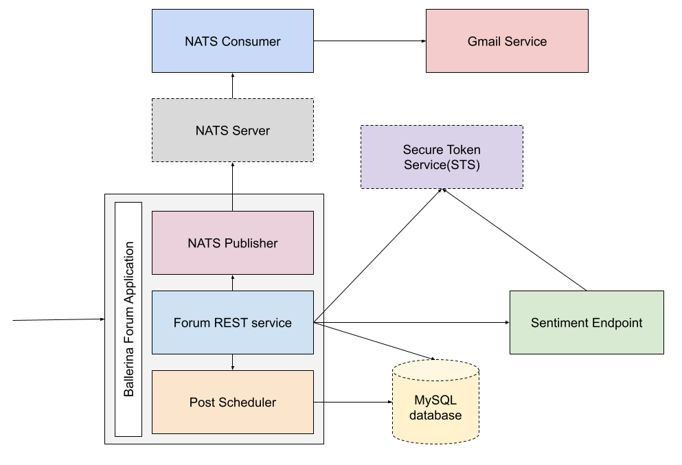

# Integration Basics with Ballerina

## Training Objective

Cover basic concepts related to integration. Following sessions will cover different topics deeply.

## Areas Covered

- Installing and Managing distributions
- Writing a simple RESTful service
- Accessing database
- Data transformation with data mapper
- HTTP client
- Service/Client security with SSL/MTLS
- Security - OAuth2
- Resiliency
- Building Docker images

## Prerequisites

- Install the latest version of Ballerina
- Set up VS code by installing the Ballerina extension
- Install Docker

## Scenario

The scenario is based on a simple API written for a forum site, which has users, associated posts and comments. Following depicts the high level component diagram:



The forum REST service exposes the following resources:

| Resource                       | Description                            |
|--------------------------------|----------------------------------------|
| `POST api/users`               | Create a new user                      |
| `POST api/login`               | Login as with user credentials         |
| `POST api/users/{id}/posts`    | Create a new forum post                |
| `GET api/posts`                | Get all the forum posts                |
| `GET api/posts/{id}`           | Get the forum post specified by the id |
| `POST api/posts/{id}/likes`    | Like a forum post                      |
| `POST api/posts/{id}/comments` | Comment on a post                      |

> **Note:** The service should be started in port **4000** to test with the frontend application.

For testing, the MySQL database can be started using the docker-compose. The database is configured with the following properties:

| Property | Value          |
|----------|----------------|
| Host     | localhost      |
| Port     | 3306           |
| Username | forum_user     |
| Password | dummypassword  |
| Database | forum_database |

Following is the entity relationship diagram:


## Task 3 - Verify the post content with the sentiment analysis service

The mock sentiment analysis service written in Ballerina is available in the `backend/sentiment-api` directory. The service exposes a single resource, which accepts a string and returns a sentiment score.

- Port: `9000`

- Path: `/text-processing/api/sentiment`

- Method: `POST`

- Request body:

  ```json
  {
    "text": "This is a sample text"
  }
  ```

- Success response - `200 OK`:

  ```json
  {
    "probability": { 
      "neg": 0.30135019761690551, 
      "neutral": 0.27119050546800266, 
      "pos": 0.69864980238309449
    }, 
    "label": "pos"
  }
  ```

The label can be one of the following values:

- `pos` - Positive sentiment
- `neg` - Negative sentiment
- `neutral` - Neutral sentiment

Pass the post tiltle and description to the sentiment analysis service and verify the sentiment score. If the label is `neg`, then the post is forbidden.

- Rejected response - `403 FORBIDDEN`:

  ```json
  {
    "error_message": "Post contains negative sentiment"
  }
  ```

### Task 3.1 - Connect to the sentiment analysis service without SSL

The sentiment analysis service is not secured with SSL. Therefore, you can connect to it without SSL. Use an [HTTP client](https://ballerina.io/learn/by-example/http-client-send-request-receive-response/) to connect to the sentiment analysis service.

### Task 3.2 - Secure the sentiment analysis service with SSL and connect to it

[Secure the sentiment analysis service with SSL](https://ballerina.io/learn/by-example/http-service-ssl-tls/) and connect to it. Use an [HTTP client secured with SSL](https://ballerina.io/learn/by-example/http-client-ssl-tls/) to connect to the sentiment analysis service.

> **Note:** For testing purpose you can use the self-signed certificates provided in the `resources` directory of each service.

### Task 3.3 - Secure the sentiment analysis service with mutual SSL and connect to it

[Secure the sentiment analysis service with mutual SSL](https://ballerina.io/learn/by-example/http-service-mutual-ssl/) and connect to it. Use an [HTTP client secured with mutual SSL](https://ballerina.io/learn/by-example/http-client-mutual-ssl/) to connect to the sentiment analysis service.

> **Note:** For testing purpose you can use the self-signed certificates provided in the `resources` directory of each service.

### Task 3.4 - Secure the sentiment analysis service with OAuth2 and connect to it

[Secure the sentiment analysis service with OAuth2](https://ballerina.io/learn/by-example/http-service-oauth2/) and connect to it. Use an [HTTP client secured with OAuth2 refresh token grant type](https://ballerina.io/learn/by-example/http-client-oauth2-refresh-token-grant-type/) to connect to the sentiment analysis service.

Connect to the mock STS endpoint is available through docker compose. The endpoint deatils are as follows:

| Property                                             | Value                                       |
|------------------------------------------------------|---------------------------------------------|
| Introspection Endpoint                               | `https://localhost:9445/oauth2/introspect`  |
| Authorization header for introspection (admin:admin) | `"Authorization": "Basic YWRtaW46YWRtaW4="` |
| Refresh Endpoint                                     | `https://localhost:9445/oauth2/token`       |
| Client ID                                            | `FlfJYKBD2c925h4lkycqNZlC2l4a`              |
| Client Secret                                        | `PJz0UhTJMrHOo68QQNpvnqAY_3Aa`              |
| Refresh Token                                        | `24f19603-8565-4b5f-a036-88a945e1f272`      |

> **Note:** The mock STS endpoint is secured with SSL and the self-signed public certificate of the STS service is given in the `resources` directory.
